# ECG Signal Processing & Arrhythmia Classification

An end-to-end, from-scratch pipeline on the [MIT-BIH Arrhythmia Database](https://physionet.org/content/mitdb/1.0.0/): raw ECG → filtering → a hand-built Pan-Tompkins-style R-peak detector → beat segmentation → labels → engineered features → classical machine learning → patient-level evaluation → error analysis.

> **This is an educational engineering project, not a clinical tool.** Nothing here has been clinically validated, and no result should be read as diagnostic performance or medical advice.

## Overview

The task is **binary beat classification: Normal vs Abnormal**, using single-lead (MLII) ECG. Everything from the signal filter to the evaluation code is implemented and tested in this repository (`src/`, `tests/`), with the experiments in 13 notebooks and 5 scripts.

**What is different from a typical "ECG classifier" project:** evaluation was designed to avoid the usual ways of fooling yourself.

- **Patient-level splits.** No patient contributes beats to both training and testing (a leakage demo in notebook 08 shows why this matters).
- **Pre-registered decisions.** The feature-adoption and model-selection rules were committed to git *before* any result was computed. The model was then **frozen**, and the held-out test patients were scored **once**.
- **Honest reporting.** The frozen model turned out to generalise badly at its operating threshold (44% of normal beats flagged on the test patients). That is reported as it is, and the selection was **not** changed afterwards.
- **Error analysis as a deliverable.** Errors are traced to specific patients, beat types, signal quality, class balance, features and the detector, with the evidence for each explanation stated.

**Headline results** (details in [Results](#results)):

| | Development CV (12 patients) | Held-out test (5 patients) |
|---|---|---|
| Frozen model: logistic regression, precision / recall / F1 | 0.726 / 0.580 / 0.645 | 0.174 / 0.908 / 0.293 |
| False-alarm rate (normal beats flagged) | 4.0% | 44.0% |
| ROC-AUC / PR-AUC | 0.762 / 0.680 | 0.890 / 0.681 |

The model ranks beats reasonably (test ROC-AUC 0.89) but its 0.5 threshold does not transfer between patients: 98% of its false alarms come from two of the five test patients. With only five test patients, uncertainty is large (95% patient-level interval for test precision: 0.06 to 0.92).

## Motivation

Beat-classification papers often report very high accuracy that does not survive contact with a new patient, mainly because beats from the same recording end up in both training and test sets. I wanted to build the whole chain myself and to measure, not assume, how well it generalises across patients. The project is also a way to learn signal processing, ECG physiology and careful ML evaluation by implementing them.

## Dataset

**MIT-BIH Arrhythmia Database** (PhysioNet): 48 half-hour two-channel ambulatory recordings, sampled at 360 Hz, with beat-by-beat reference annotations. Records 201 and 202 come from the same patient, so the split treats them as one patient. Data is fetched with `wfdb` and never committed (see [`data/README.md`](data/README.md)).

**Which records are used.** Not all 48, and the selection matters for how to read the results:

1. 47 records were surveyed (`scripts/survey_records.py`, saved in `results/metrics/record_survey.txt`). Record 208 could not be downloaded (server error) and was never evaluated.
2. Four records with paced beats were skipped, leaving **43 eligible records**.
3. A **detector quality gate** kept records where my R-peak detector reached precision and recall of at least 0.98 (±50 ms): **30 records**.
4. Of those, records with at least 50 abnormal beats form the **pool of 17 records** (40,940 labelled beats, 5,555 of them abnormal, 13.6%).

The gate keeps the labels trustworthy (a missed or misplaced beat can't be classified correctly), but it also **removes recordings that are hard for the detector**, such as 106, 203, 207, 210 and 221–223. The pool is therefore easier than the full database.

**Label mapping** (a simplified binary grouping based on the AAMI EC57 classes, implemented in `src/feature_extraction.py`):

| Label | MIT-BIH symbols | Beats in the pool |
|---|---|---|
| Normal | `N` normal, `L` left bundle branch block, `R` right bundle branch block, `e`, `j` escape beats | 35,385 (`N` 29,318, `R` 4,076, `L` 1,985, `j` 6) |
| Abnormal | `V` ventricular, `A` atrial premature, `F` fusion, `J` junctional, `a` aberrated atrial, `S`, `E` | 5,555 (`V` 3,012, `A` 2,057, `F` 389, `J` 81, `a` 16) |
| Excluded | paced and unclassifiable beats (`/`, `f`, `Q`), non-beat markers (rhythm changes, noise flags, ...) | not in the table |

Note that bundle-branch-block beats are labelled **Normal** in this scheme (following the AAMI grouping); they are a stable morphology rather than an irregular beat, but they look very different from ordinary normal beats, and that turns out to matter (see [Error Analysis](#error-analysis)).

## Pipeline

```
raw ECG (MLII, 360 Hz)
  -> band-pass filter 0.5-40 Hz (Butterworth order 4, zero phase)
  -> R-peak detection (derivative -> square -> moving-window integration -> find_peaks -> search-back)
  -> validate against annotations (+-50 ms): precision / recall / F1
  -> segment beats: 200 ms before to 400 ms after each R peak (216 samples)
  -> label from the nearest annotated beat (<= 150 ms)  ->  Normal / Abnormal
  -> 13 engineered features per beat  (+ record-relative versions)
  -> patient-level split: 12 development patients (4 grouped CV folds) + 5 held-out test patients
  -> logistic regression / random forest / gradient boosting, same folds
  -> pre-registered selection -> frozen protocol -> one-shot test evaluation -> error analysis
```

Reusable code lives in `src/`; the notebooks (`notebooks/01`–`13`) are the exploration and visualisation, one per stage.

## Signal Processing

ECG contaminants (baseline wander below about 0.5 Hz, muscle and mains noise above about 40 Hz) are removed with a **4th-order Butterworth band-pass filter (0.5–40 Hz) applied forwards and backwards (`filtfilt`)**. Zero-phase filtering matters here because it does not shift the QRS in time, which would corrupt the R-peak timing used for matching and segmentation. The filter is `src/preprocessing.py:filter_ecg`; a unit test checks that it passes 10 Hz, rejects 0.05 Hz and 120 Hz, and does not move a pulse.

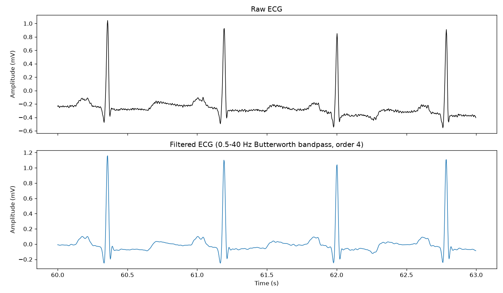

*Raw (top) vs filtered (bottom) ECG, record 100. Baseline drift and high-frequency ripple are suppressed and the QRS complexes are preserved.*

## R-Peak Detection

A simplified **Pan-Tompkins-style detector**, written out stage by stage rather than called from a library (`src/peak_detection.py`):

1. **Derivative** (`np.gradient`) emphasises the steep slopes of the QRS.
2. **Squaring** makes everything positive and stresses large slopes.
3. **Moving-window integration** over 0.1 s (36 samples) merges each QRS into a single pulse.
4. **Candidate detection** with `scipy.signal.find_peaks` on the integrated signal: minimum spacing 0.3 s (a 200 bpm limit, 108 samples), and height and prominence at least 20% of the record's maximum.
5. **Search-back:** each candidate is moved to the maximum of the *filtered* signal within ±18 samples, so the peak lands on the actual R wave.

**Validation:** detections are matched one-to-one to reference beat annotations within **±50 ms** (`match_peaks`), then counted as TP/FP/FN (`detection_metrics`).

| | TP | FP | FN | Precision | Recall | F1 |
|---|---|---|---|---|---|---|
| Record 100 (clean; used to develop the detector) | 2,271 | 1 | 2 | 1.000 | 0.999 | 0.999 |
| Record 108 (noisy; not used for development) | | | | 0.987 | 0.698 | 0.818 |
| All 43 eligible records: median | | | | 1.000 | 0.990 | |

Record 100 is the record the detector was developed on, so its score is optimistic. Record 108 shows what happens on a noisier recording with inverted QRS complexes: precision stays high while recall drops to 0.698, as a slice of that record shows below. On the full survey, 30 of 43 records pass the 0.98/0.98 gate; some others are much worse (for example record 207 reaches precision 0.169).

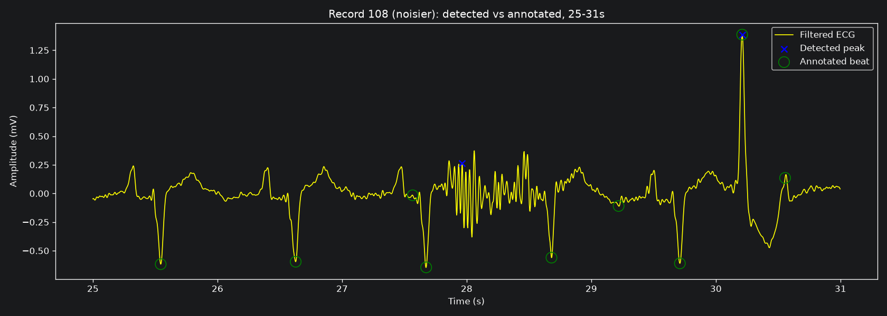

*Record 108, 25–31 s: the detector (blue ×) marks only two things in this slice, the tall beat at about 30.2 s and a noise burst near 28 s that has no annotation (a false positive). Most annotated beats (green circles) are inverted, downward QRS complexes and have no detection. The record's overall recall is 0.698.*

**Known limitation:** the thresholds are relative to each record's own maximum, so on a signal with no beats at all the detector still reports noise peaks (found while writing tests). It also misses wide ventricular beats more often than normal beats (see [Error Analysis](#error-analysis)).

## Beat Segmentation

Each detected R peak gets a fixed window of **200 ms before and 400 ms after** (72 + 144 = 216 samples at 360 Hz), taken from the filtered signal. Peaks whose window would leave the record, or that have no RR neighbour on both sides, are dropped. Each beat's label comes from the nearest **beat** annotation within 150 ms (non-beat markers never label a beat). Unlabelled and excluded beats are counted per record in notebook 06.

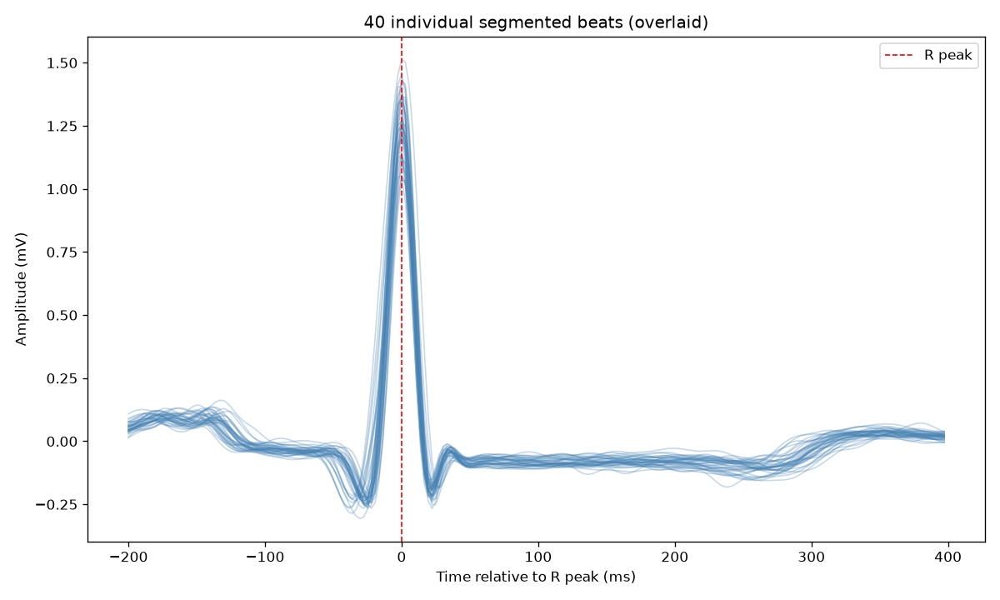

*40 overlaid segmented beats. The R peak sits at index 72 in every window (checked by a unit test).*

## Feature Engineering

Thirteen features were extracted per beat (`src/feature_extraction.py`):

- **Timing:** RR interval before and after the beat, their ratio, instantaneous heart rate.
- **Waveform statistics** of the 600 ms window: mean, standard deviation, min, max, energy.
- **QRS shape:** R amplitude, dominant-deflection amplitude, QRS peak-to-peak, QRS full width at half maximum (FWHM).

Exploratory analysis (notebook 07) showed four of these are near-duplicates (`heart_rate_bpm` = 60 / `rr_pre_s`; `energy_mv2s` ≈ `amp_std`; `r_amplitude_mv` and `dominant_deflection_mv` ≈ `amp_max`), so they were dropped. Four **record-relative** versions (RR before/after, QRS peak-to-peak, amplitude std, each divided by that record's own median) were added, because raw amplitude and heart rate differ strongly between patients. The result is **13 model features**. The relative features use only that record's own beats and no labels.

Two further **rhythm-context features** (variability and relative length of the preceding RR intervals) were defined and their adoption rule was committed before any result. They improved PR-AUC for all three models but failed the pre-registered rule for the tree models, so they are **not** in the frozen model (details in [Machine Learning](#machine-learning)).

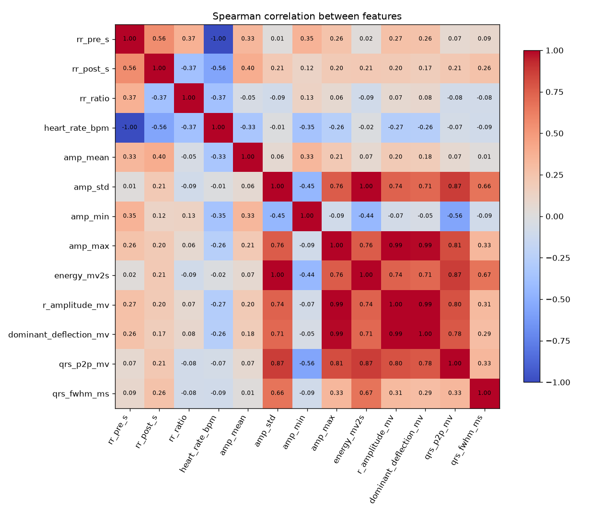

*Spearman correlations of the 13 extracted features (notebook 07). The near-duplicate pairs that were dropped are visible: `rr_pre_s` vs `heart_rate_bpm` (−1.00), `amp_std` vs `energy_mv2s` (1.00), `amp_max` vs `r_amplitude_mv` and `dominant_deflection_mv` (0.99). The remaining amplitude features (`amp_std`, `amp_max`, `qrs_p2p_mv`) are still strongly correlated (0.76–0.87), which is why the logistic regression's weights became hard to read later.*

## Machine Learning

Three models were compared under **identical patient-grouped cross-validation** on the 12 development patients (`src/models.py`):

| Model | Settings |
|---|---|
| Logistic regression | fixed physiological clipping of RR-derived features, standardisation fitted on training data only, L2, C = 1, max 1000 iterations |
| Random forest | 300 trees, seed 42 |
| Histogram gradient boosting | scikit-learn defaults (100 iterations, early stopping off), seed 42 |

No heavy hyperparameter search was done, by design. Class weights were tested but are not in the default models.

**Split** (`src/splitting.py`, `results/metrics/record_split.json`): the unit is the **patient** (records 201 and 202 count as one). A deterministic exhaustive search, decided from metadata only and never from model results, picked **5 test patients** (116, 118, 119, 209, 215): the combination whose shares of all beats, abnormal, `V` and `A` beats were closest to 30%. Patients that are the sole source of a beat type stay in training (213 for `F`, 214 for `L`), and no patient may supply more than 40% of the abnormal beats on either side. The other 12 patients form four grouped cross-validation folds. An assertion (`check_split`, unit-tested) fails if a patient or beat could appear on both sides.

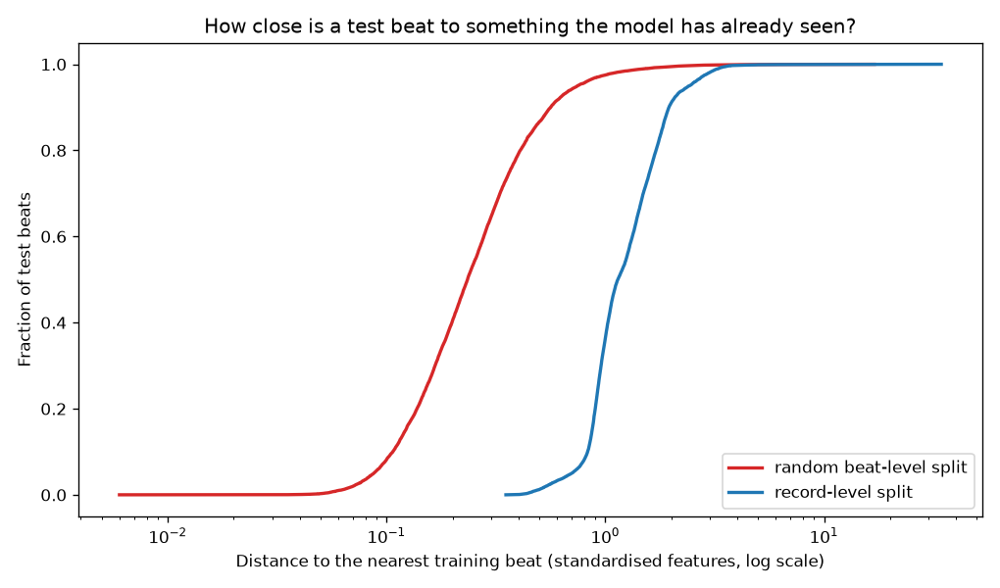

*Why patient-level splits: with a random beat-level split, the median test beat lies 0.23 (standardised units) from its nearest training beat, versus 1.14 for a record-level split; 89.8% of test beats have an adjacent beat in training and 29.6% share raw samples with one. Record-level: 0% and 0%.*

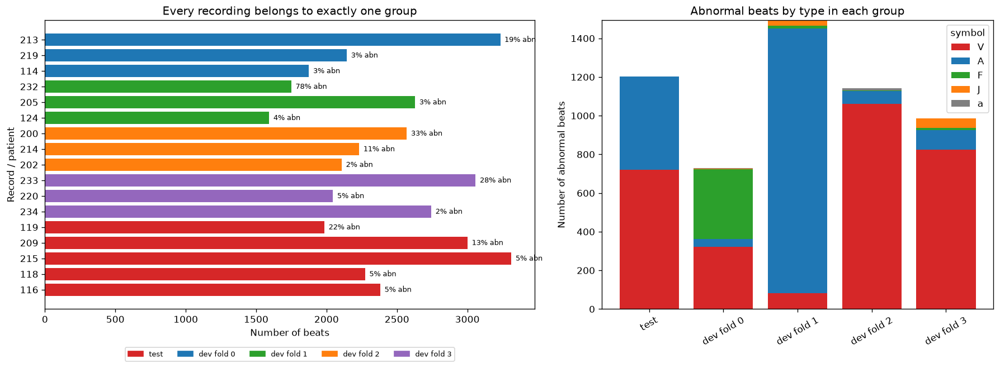

**Pre-registered decisions** (git history: `1412da9` rules committed before results, `04d36c7` freeze, `c3ea2f2` final test):

- *Feature rule:* adopt the rhythm-context features only if every model that improves PR-AUC also lowers false alarms in atrial fibrillation and flutter. **Outcome: not adopted** (it helped the logistic regression: flutter false alarms 93.3% → 11.5%, but not the forest or boosting).
- *Selection rule:* choose the highest development PR-AUC, but prefer the simpler model if its advantage is within the patient-bootstrap noise. The forest scored highest (PR-AUC 0.725), but its edge over logistic regression (+0.034, 95% interval −0.109 to +0.135) included zero, so **logistic regression was selected**.
- The protocol (model, features, threshold 0.5, split hash) is stored in `results/metrics/frozen_protocol.json`.

## Evaluation

- **Positive class = Abnormal.** Binary averaging: precision, recall and F1 are for the abnormal class. The task is binary, so multiclass averaging does not apply.
- **False-alarm rate** = normal beats flagged abnormal. **ROC-AUC** and **PR-AUC** are threshold-free. Accuracy is reported but not relied on: always predicting Normal scores 0.845 (development) and 0.907 (test).
- **Development:** out-of-fold predictions from grouped 4-fold CV, so every beat is scored by a model that never saw its patient.
- **Test:** the frozen logistic regression is trained on all 12 development patients and scored once on the 5 test patients. The random forest and boosting were scored on the same test patients **for context only**; they were not used to change the selection.
- **Uncertainty:** patient-level bootstrap (whole patients resampled) since beats from one patient are not independent.
- The threshold is fixed at 0.5. No model was tuned, and the test set was not used to change any choice.

## Results

### Development cross-validation (12 patients, 27,984 beats, 15.5% abnormal, threshold 0.5)

| Model | Accuracy | Precision | Recall | F1 | False alarms | ROC-AUC | PR-AUC |
|---|---|---|---|---|---|---|---|
| **Logistic regression** (selected) | 0.901 | 0.726 | 0.580 | 0.645 | 4.0% | 0.762 | 0.680 |
| Random forest | 0.884 | 0.637 | 0.588 | 0.612 | 6.2% | 0.904 | 0.725 |
| Gradient boosting | 0.883 | 0.632 | 0.597 | 0.614 | 6.4% | 0.820 | 0.689 |
| Always Normal (baseline) | 0.845 | undefined | 0.000 | undefined | 0% | 0.500 | 0.155 |

The three models are **not separable** on 12 patients (differences are inside the bootstrap noise), and all miss about 40% of abnormal beats.

### Held-out test (5 patients, 12,956 beats, 9.3% abnormal, threshold 0.5)

| Model | Accuracy | Precision | Recall | F1 | False alarms | ROC-AUC | PR-AUC |
|---|---|---|---|---|---|---|---|
| **Logistic regression** (frozen) | 0.592 | 0.174 | 0.908 | 0.293 | 44.0% | 0.890 | 0.681 |
| Random forest (context only) | 0.904 | 0.493 | 0.980 | 0.656 | 10.3% | 0.988 | 0.931 |
| Gradient boosting (context only) | 0.911 | 0.511 | 0.987 | 0.673 | 9.7% | 0.992 | 0.938 |
| Always Normal (baseline) | 0.907 | undefined | 0.000 | undefined | 0% | 0.500 | 0.093 |

95% patient-bootstrap intervals for the frozen model on the test set are very wide: precision 0.058–0.918, recall 0.792–0.995, F1 0.110–0.924, false-alarm rate 0.012–0.828, ROC-AUC 0.714–0.998, PR-AUC 0.205–0.984.

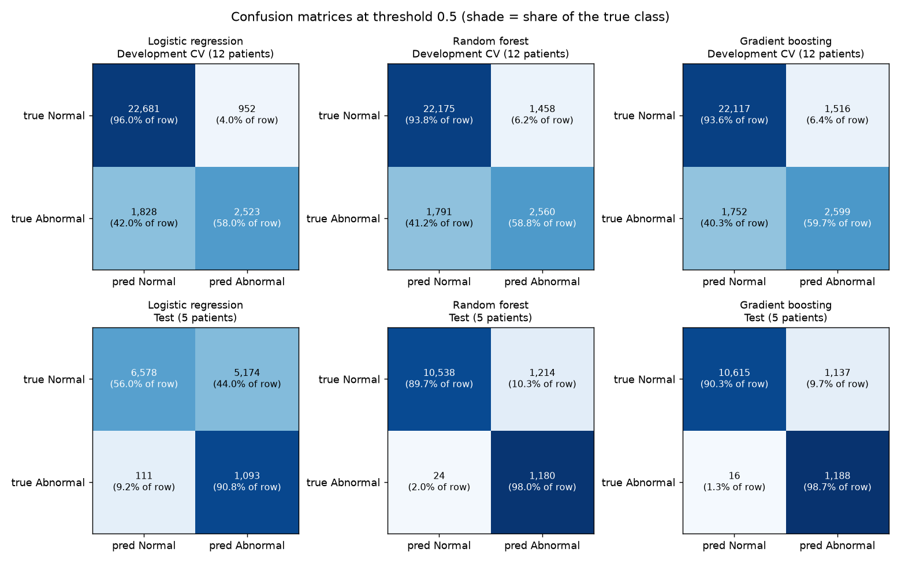

**Per test patient (frozen logistic regression):**

| Patient | Beats | Abnormal | Precision | Recall | False alarms | ROC-AUC |
|---|---|---|---|---|---|---|
| 116 | 2,382 | 109 | 0.964 | 0.982 | 0.2% | 0.997 |
| 118 | 2,274 | 112 | 0.047 | 0.938 | 98.5% | 0.500 |
| 119 | 1,985 | 444 | 1.000 | 1.000 | 0% | 1.000 |
| 209 | 3,002 | 384 | 0.710 | 0.740 | 4.4% | 0.905 |
| 215 | 3,313 | 155 | 0.050 | 0.987 | 92.6% | 0.983 |

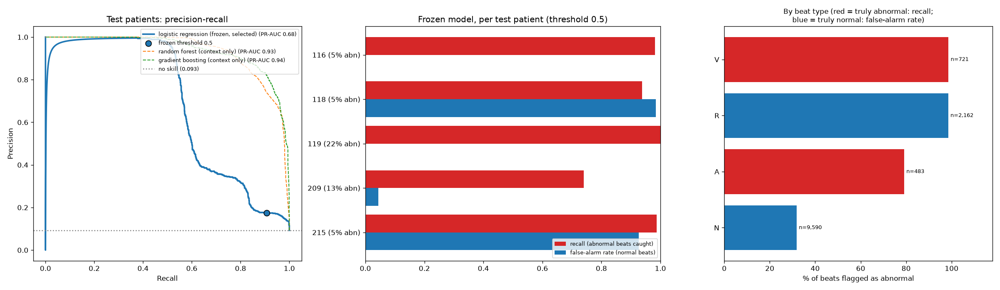

### How to read this honestly

- The selected model **does not generalise across patients at its frozen threshold**: two patients (118 and 215) are flooded with false alarms and account for 98% of all false alarms.
- Its **ranking** is reasonable (test ROC-AUC 0.89; 215 has ROC-AUC 0.98 despite 93% false alarms), so the failure is where the 0.5 line falls for a given patient, not that abnormal beats look normal.
- **Cause (post-hoc diagnosis):** the logistic regression relies on three strongly collinear amplitude features with large offsetting weights (per standard deviation: `amp_max` −9.8, `amp_std` +6.3, `qrs_p2p_mv` +4.2). Those weights only cancel if a patient's amplitudes move together as in the training patients. The median log-odds of a normal beat is −4.83 in training but +4.68 for record 118 and +1.40 for record 215.
- The random forest and boosting did much better on this test set, but that is a **hypothesis to check on new data, not a model choice**. Changing the selection because it scored better on the test set would defeat the purpose of the test. They also fail differently: they flag 32% (forest) and 24% (boosting) of record 116's normal beats, where the logistic regression flags 0.2%.
- **The development-CV comparison could not have predicted this.** The pre-registered rule reasonably picked the simplest model, and on these five patients it picked the worse one. A 12-patient cross-validation was too coarse.

## Error Analysis

Reproduced by `scripts/error_analysis*.py` (output in `results/metrics/error_analysis.txt`). All predictions are from models that never saw the beat's patient.

### Which classes are misclassified

| Beat type | Development recall (LR / RF / GB) | Test |
|---|---|---|
| `V` ventricular | 99% / 99% / 99% | 98.6–99.7% |
| `F` fusion | 20% / 35% / 49% | none in test |
| `A` atrial | 10% / 9% / 8% | 79% / 95% / 97% |
| `J` junctional | 1% | none in test |

Errors are concentrated in a few patients: in development, record 232 alone produces **45.5%** of the logistic regression's errors; in test, 215 and 118 produce **55.4%** and **40.4%**. Atrial recall in development is mostly one patient: 1,362 of 1,574 `A` beats are from record 232 (7% recall there); without it, atrial recall is 30.7% (LR), 60.8% (RF), 54.2% (GB).

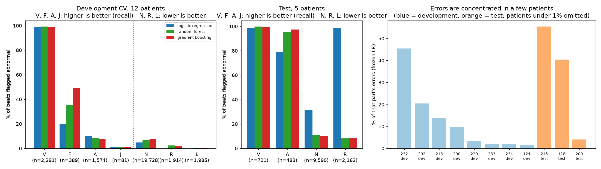

### Representative misclassified beats

One random beat from each of the patients with the most errors in each category (fixed seed, not hand-picked):

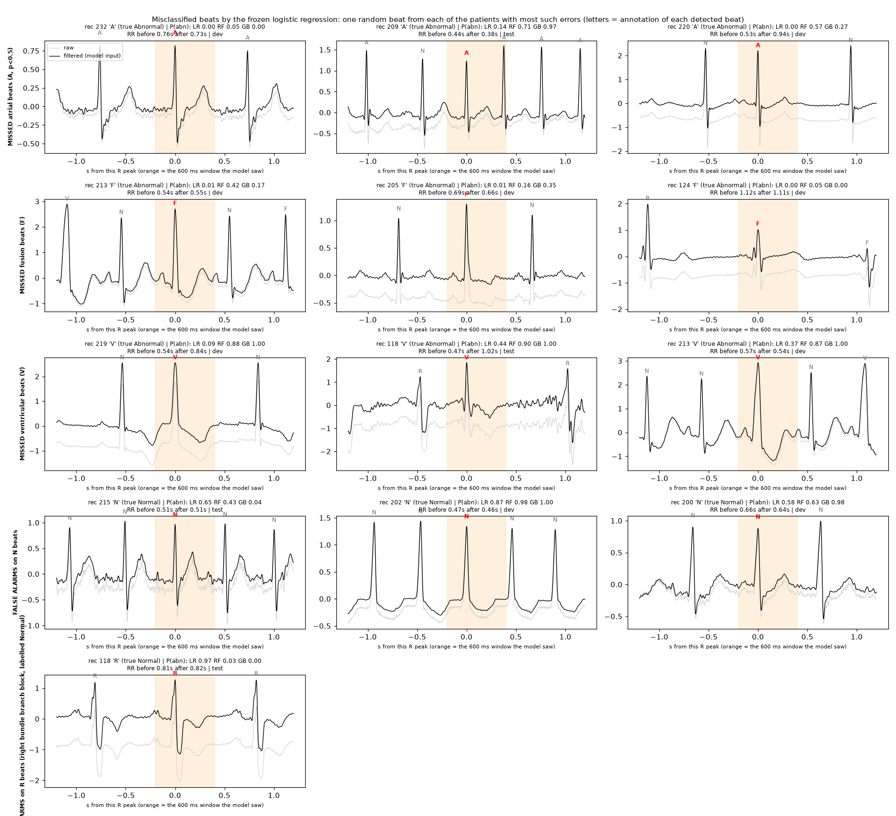

Read for signal quality and features, not diagnosis: several missed atrial and fusion beats look like their neighbours in shape and timing (for example record 232); the false alarms in 215 and 200 are ordinary-looking normal beats; the false alarm in 202 occurs at a fast rate.

### Does noise contribute? Only weakly, if at all

I measured high-frequency noise and baseline wander in each beat's window on the **raw** signal, ranked within each patient. For normal beats the false-alarm rate is flat across noise quartiles (0.181, 0.170, 0.166, 0.168, and 0.192 for the noisiest 10%). For `A` beats, more noise goes with *fewer* errors (78.5% → 65.7%). Between patients, noise vs error rate has ρ = +0.39 (p = 0.12, n = 17), not significant. The noisiest 1% of beats has a 32.7% error rate vs 19.7% overall, but half of those beats are in record 200, so that is a patient effect. The noisiest beats are genuinely messy, so noise can hurt individual beats; it is just not the main driver, and my noise measure is crude.

### Does class imbalance contribute? It moves the threshold, not the separability

With `class_weight="balanced"` the logistic regression's development recall rises from 0.580 to 0.654, but false alarms rise from 4.0% to 12.2%. At a **fixed 5% false-alarm rate**, recall barely changes (LR 0.592 → 0.626; random forest 0.583 → 0.590). The rare classes are thin in a different way: 87% of `A` beats and 92% of `F` beats come from a single patient each, so the shortage is of *patients*, not just beats.

### Are the features insufficient? Partly: the information is there, but does not transfer between patients

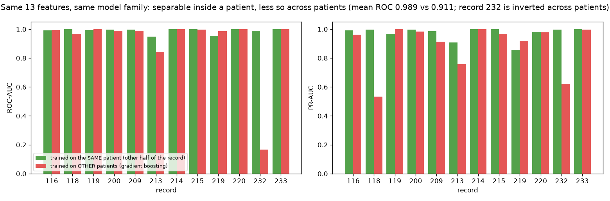

Gradient boosting on the same 13 features, trained on one half of a record and tested on the other, reaches a mean ROC-AUC of **0.989**; trained on *other* patients it reaches **0.911**. Record 232 is inverted across patients (ROC-AUC 0.168). (This shows the features can separate the classes within a patient; it is not a generalisation estimate.) Adding the amplitude-normalised beat waveform (108 samples) did **not** help in development CV (gradient boosting ROC-AUC 0.820 → 0.765, PR-AUC 0.689 → 0.664), so simply adding shape information is not an easy fix.

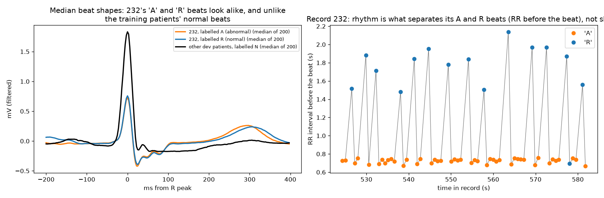

*Record 232: its `A` and `R` beats have near-identical median shapes (both very different from the training patients' normal beats) and are separated in this record by rhythm (R beats follow long pauses of about 1.5–2.1 s, A beats sit at a regular 0.7 s), which the model cannot use across patients.*

### Could the R-peak detector or segmentation be responsible?

**Not for the classifier's errors, but the detector has its own hidden error.** Beats the detector misses never reach the classifier:

- Missed-beat rate: **3.25% for abnormal-type beats vs 0.43% for normal-type** (`V`: 148 of 3,114 = 4.75%; `a`: 6 of 22).
- End-to-end abnormal recall, counting missed beats as misses: **0.563 in development** (0.585 among detected beats) and **0.897 on test** (0.909 among detected).
- Only 58 detector false positives across the 17 records.
- Localisation of kept beats is not linked to errors (49 beats more than 50 ms from the annotation: 2.0% error rate vs 19.7% for the rest), and windows containing a neighbouring beat have *lower* error rates.

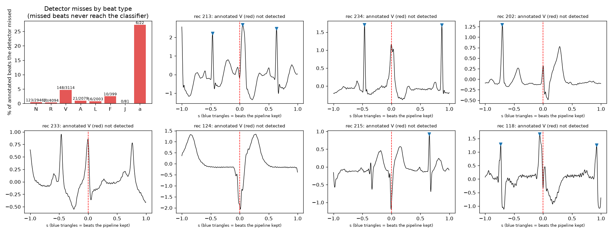

*Missed annotated `V` beats: in some (213, 118) a peak was detected but more than 50 ms from the annotation; in others (234, 233, 124, 202) the beat is a clear deflection with no detection. Why is not established (see the explanations below).*

### Plausible explanations, in order of evidence

1. **Between-patient variation in amplitude and rhythm is the dominant cause.** *Evidence:* error concentration in a few patients; the within- vs cross-patient gap; the logit-shift decomposition for 118 and 215.
2. **Annotations that the 13 features cannot express** (e.g. record 232, where beats labelled abnormal look and time like the rest of the record). *Evidence:* identical median shapes and RR pattern. *Untested:* would need P-wave or other information, and I cannot verify how those beats were annotated.
3. **Rare classes are supported by very few patients** (`A`, `F`, `J`). *Evidence:* single-patient concentration; class weighting adds little separability.
4. **Fusion beats look intermediate between normal and ventricular.** *Plausible from the examples; not tested.*
5. **The detector under-responds to some wide ventricular beats.** *A guess: missed beats have normal amplitude and normal spacing, so neither explains them; not tested.*
6. **Noise on individual beats.** *Real in examples; no measurable aggregate effect.*
7. **Annotation ambiguity or label noise.** *Cannot be quantified from this data.*

## Limitations

- **Educational project. No clinical validation.** Performance figures are properties of this dataset, this beat-level task and this evaluation protocol only.
- **Few patients.** 12 development and 5 test patients. Results vary enormously between patients, the test intervals are very wide, and the development CV could not separate the models.
- **The record pool is easier than the full database.** It was chosen with a detector-quality gate, which excludes records my detector handles poorly.
- **The frozen model generalises poorly at its threshold** (44% false alarms on the test patients). The model selected by the pre-registered rule did worse on the test patients than the two tree models, and I did not change the selection.
- **Binary labels lump heterogeneous classes.** Normal includes bundle-branch-block beats; Abnormal mixes ventricular, atrial, fusion and junctional beats with very different morphologies and support. Per-class results differ hugely.
- **Single lead (MLII), single dataset, a fixed 0.5 threshold, and features only from one 600 ms window** plus adjacent RR intervals. There is no per-patient threshold or calibration.
- **Record-relative features use each patient's own median**, so applying the model to a new patient needs a warm-up period of that patient's beats.
- **The detector is simplified and misses some ventricular beats** (4.75%), which the classifier never sees; thresholds are relative to the record's maximum.
- **Pooled metrics are dominated by large patients**, and beats from one patient are correlated (hence the patient-level bootstrap).
- **Reference annotations are not ground truth**; they carry their own ambiguity.
- **Reproducibility was verified on one platform** (see below).

## Future Work

Only things the results actually motivate:

- **A version-2 evaluation on data not used so far**, under new pre-registered rules. Twelve recordings passed the detector gate but were never used because they have fewer than 50 abnormal beats (101, 103, 112, 113, 115, 117, 121, 122, 123, 212, 230, 231): about 24,000 normal and only 23 abnormal beats. They cannot say much about recall, but they directly test the false-alarm flooding found here. The current test set stays as the record of version 1.
- **Leave-one-patient-out cross-validation** for finer model comparison than 4 folds of 3 patients.
- **Per-patient threshold or calibration** using a short warm-up segment, since the failure is one of threshold transfer.
- **Amplitude-invariant features or regularisation** for the collinear amplitude features; the rhythm-context features, which helped the linear model's flutter false alarms, as a candidate under a fresh pre-registration.
- **Detector improvements for wide ventricular beats**, and understanding record 232.

## Reproducibility

Tested end to end on one machine: **Windows 11, Python 3.14.0**, with the exact versions in `requirements.txt`. A fresh clone, a fresh virtual environment and the steps below reproduced every committed result file and figure exactly (checked against git; the beat table matched to floating-point tolerance). **Other operating systems and Python versions are untested**; the random forest and boosting could differ in the last digits on another platform.

```bash
git clone <this repository> ecg-signal-ml     # clone to a SHORT path; see the notes below
cd ecg-signal-ml
python -m venv venv
venv\Scripts\activate                         # macOS/Linux: source venv/bin/activate  (untested)
pip install -r requirements.txt
python -m pytest                              # 21 tests, a few seconds, no download needed
```

**Run order** (records are downloaded automatically on first use into `data/mitdb/`, which is gitignored):

| Step | What | Approx. time (my machine) |
|---|---|---|
| Notebook `06_feature_extraction` | builds `data/processed/beat_features.csv` (required by everything after) | ~12 min, mostly downloading |
| Notebooks `07`–`09` | EDA, split (asserts the committed split is reproduced), logistic regression | ~1.5 min |
| Notebooks `10`–`12` | random forest, gradient boosting, rhythm features and model selection (writes `frozen_protocol.json`) | ~7.5 min |
| Notebook `13_final_test_evaluation` | one-shot test evaluation (writes `test_results.json`) | ~0.5 min |
| `python scripts/evaluate_models.py` | comparison tables and confusion matrices | ~0.5 min |
| `python scripts/error_analysis_data.py`, then `error_analysis.py`, then `error_analysis_figures.py` | error analysis (run in this order) | ~1 min |

Notebooks `01`–`05` are the earlier exploratory stages (loading, filtering, detection, segmentation, labelling); they stream records from PhysioNet on each run and need internet.

**Notes**

- **Run notebooks with their own folder as the working directory** (Jupyter does this by default); they use paths like `../results`. Run scripts from the repository root.
- **On Windows, clone to a short path** (for example `C:\projects\`). `pip install` failed in my test when the path was very long (Windows' 260-character limit; long paths can be enabled in Windows settings).
- **Randomness:** the forest and boosting use seed 42, bootstraps use seed 0, and the demo random generators use seed 42; the split search and everything else is deterministic. Notebooks 10 and 11 also test sensitivity to the seed.
- **PhysioNet downloads occasionally fail** (record 208 returned a server error and was never used). Re-running resumes from the files already cached.
- **The committed notebooks contain no saved outputs**; the figures and metrics they produce are committed in `results/`.

**Repository layout**

```
ecg-signal-ml/
├── src/            preprocessing.py  peak_detection.py  feature_extraction.py  models.py
│                   splitting.py (patient-level split, leakage guard)  evaluation.py (metrics, CV, bootstrap)
├── tests/          21 small tests on synthetic signals (preprocessing, detection, features, leakage guard)
├── notebooks/      01-13, one per stage
├── scripts/        survey_records, evaluate_models, error_analysis (3 scripts)
├── results/        figures/ (33 plots) and metrics/ (record_split, frozen_protocol, test_results, comparison tables, error_analysis)
├── data/           README.md only; records and processed tables are fetched/generated locally
└── requirements.txt
```

## Data attribution

Data: [MIT-BIH Arrhythmia Database v1.0.0](https://physionet.org/content/mitdb/1.0.0/) on PhysioNet; see that page for its terms of use. If you use it, please cite:

- Moody GB, Mark RG. The impact of the MIT-BIH Arrhythmia Database. *IEEE Engineering in Medicine and Biology Magazine* 20(3):45–50 (2001).
- Goldberger AL, et al. PhysioBank, PhysioToolkit, and PhysioNet: Components of a new research resource for complex physiologic signals. *Circulation* 101(23):e215–e220 (2000).
